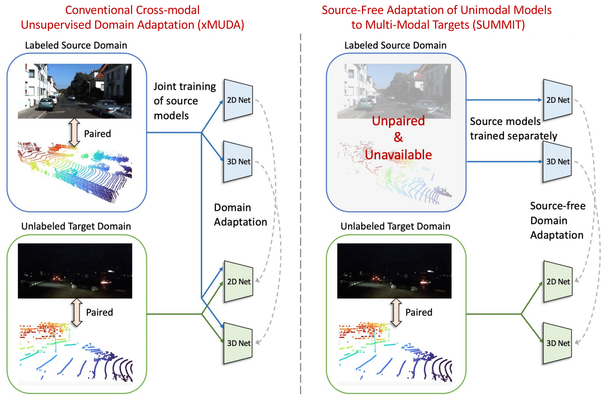

# SUMMIT: Source-Free Adaptation of Uni-Modal Models to Multi-Modal Targets

Official code for the paper.

## Paper


[SUMMIt: Source-Free Adaptation fo Uni-Modal Models to Multi-Modal Targets](https://arxiv.org/pdf/2308.11880v1.pdf)  
 Cody Simons, Dripta Raychaudhuri, Sk Miraj Ahmed, Suya You, Konstantinos Karydis, Amit K. Roy-Chowdhury
 University of California, Riverside & Army Research Lab
 ICCV 2023

If you find this code useful for your research, please cite our [paper](https://arxiv.org/pdf/2308.11880v1.pdf):

```
@inproceedings{simons2023summit,
    title={SUMMIT: Source-Free Adaptationof Uni-Modal Models to Multi-Modal Targets},
    author={Simons, Cody and Raychaudhuri, Dripta and Ahmed, Sk Miraj and Karydis, Konstantinos and You, Suya and Roy-Chowdhury, Amit},
    booktitle={ICCV},
    year={2023}
}
```

## Preparation
### Prerequisites
Tested with
* PyTorch 1.4
* CUDA 10.0
* Python 3.8
* [SparseConvNet](https://github.com/facebookresearch/SparseConvNet)
* [nuscenes-devkit](https://github.com/nutonomy/nuscenes-devkit)

### Installation
For installation please follow all instructions to install [xMUDA](https://github.com/valeoai/xmuda)

### Datasets
Please refer to [xMUDA](https://github.com/valeoai/xmuda) for instructions on downloading the NuScenes, A2D2, and SemanticKITTI datasets.
#### NuScenes LidarSeg
Please download the Full dataset (v1.0) from the [NuScenes website](https://www.nuscenes.org) and extract it.

You need to perform preprocessing to generate the data for xMUDA first.
The preprocessing subsamples the 360° LiDAR point cloud to only keep the points that project into
the front camera image. It also generates the point-wise segmentation labels using
the 3D objects by checking which points lie inside the 3D boxes. 
All information will be stored in a pickle file (except the images which will be 
read frame by frame by the dataloader during training).

Please edit the script `xmuda/data/nuscenes/preprocess.py` as follows and then run it.
* `root_dir` should point to the root directory of the NuScenes dataset
* `out_dir` should point to the desired output directory to store the pickle files

## Training
### Baseline
Train the baselines (only on source) with:
```
$ python xmuda/train_baseline.py --cfg=configs/nuscenes/usa_singapore/baseline.yaml
$ python xmuda/train_baseline.py --cfg=configs/nuscenes/day_night/baseline.yaml
$ python xmuda/train_baseline.py --cfg=configs/a2d2_semantic_kitti/baseline.yaml
```

### Pseudo-Label Generation
After having trained the xMUDA model, generate the pseudo-labels as follows:
```
$ python xmuda/test.py --cfg=configs/nuscenes/usa_singapore/xmuda.yaml --pselab @/model_2d_100000.pth @/model_3d_100000.pth DATASET_TARGET.TEST "('train_singapore',)"
```
Note that we use the last model at 100,000 steps to exclude supervision from the validation set by picking the best
weights. The pseudo labels and maximum probabilities are saved as `.npy` file.

Pseudo-labels are then further refined using a script as follows.
```
$ python xmuda/refine_pseudo_labels.py /path/to/pseudo/labels /output/path --AF
$ python xmuda/refine_pseudo_labels.py /path/to/pseudo/labels /output/path --EW --HT --k 0.5
```

Please edit the `pselab_paths` in the config file, e.g. `configs/nuscenes/usa_singapore/xmuda_pl_SF.yaml`,
to match your path of the refined pseudo-lables.

### SUMMIT
You can run the training with
```
$ python xmuda/train_xmuda_SF.py --cfg=configs/nuscenes/usa_singapore/xmuda_pl_SF.yaml
```

The output will be written to `/home/<user>/workspace/outputs/xmuda/<config_path>` by 
default. The `OUTPUT_DIR` can be modified in the config file in
(e.g. `configs/nuscenes/usa_singapore/xmuda.yaml`) or optionally at run time in the
command line (dominates over config file). Note that `@` in the following example will be
automatically replaced with the config path, i.e. with `nuscenes/usa_singapore/xmuda`.
```
$ python xmuda/train_xmuda_SF.py --cfg=configs/nuscenes/usa_singapore/xmuda_pl_SF.yaml OUTPUT_DIR path/to/output/directory/@
```

You can start the trainings on the other UDA scenarios (Day/Night and A2D2/SemanticKITTI) analogously:
```
$ python xmuda/train_xmuda_SF.py --cfg=configs/nuscenes/day_night/xmuda_pl_SF.yaml
$ python xmuda/train_xmuda_SF.py --cfg=configs/a2d2_semantic_kitti/xmuda_pl_SF.yaml
```

## Testing
You can provide which checkpoints you want to use for testing. We used the ones
that performed best on the validation set during training (the best val iteration for 2D and 3D is
shown at the end of each training). Note that `@` will be replaced
by the output directory for that config file. For example:
```
$ cd <root dir of this repo>
$ python xmuda/test.py --cfg=configs/nuscenes/usa_singapore/xmuda_pl_SF.yaml @/model_2d_065000.pth @/model_3d_095000.pth
```
You can also provide an absolute path without `@`. 

## Acknowledgements
Note that this code builds on the [xMUDA](https://github.com/valeoai/xmuda) repo.

## License
SUMMIT is released under the [Apache 2.0 license](./LICENSE).
